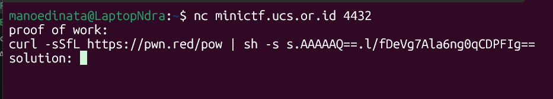

# NeedCat

Author: rootkids

```
This is your first beginning entrypoint that you must know how to make a connection with some TCP Connection program.

nc minictf.ucs.or.id 4432
atau

ncat  minictf.ucs.or.id 4432
```

Connect to the remote server with netcat. No hidden meaning.




Flag:

```
UCS{just_1ntro_for_y0u_h0w_t0_connect_1nto_TCP_CONNection}
```
