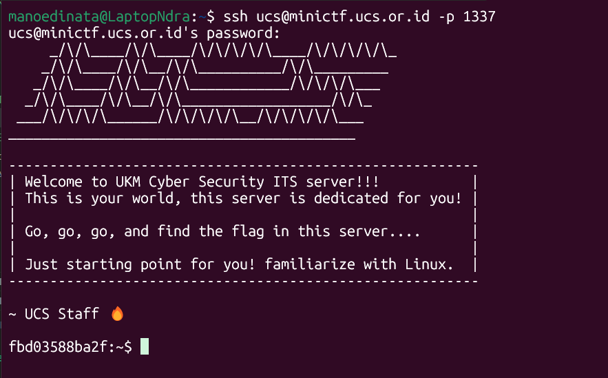
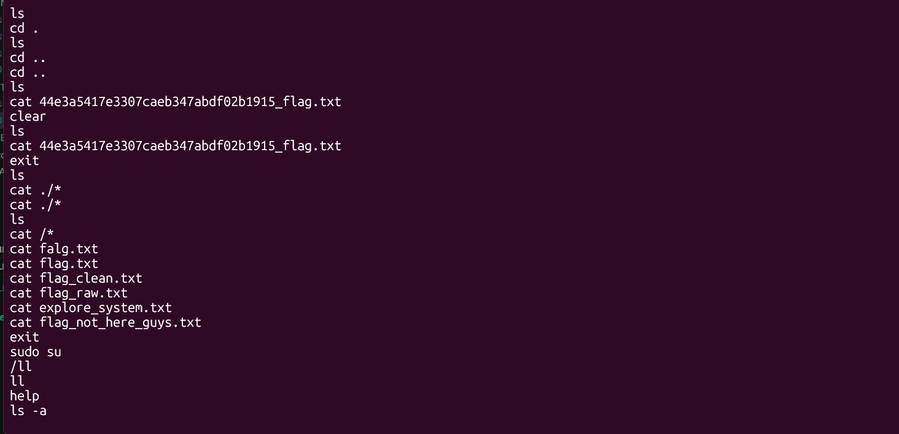
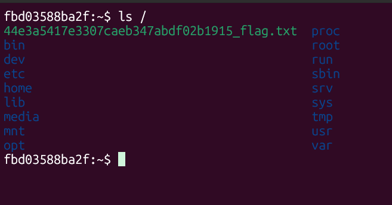
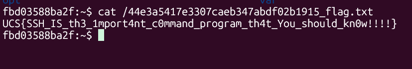

# Turn into System

Author: rootkids

```
The basic knowledge that you must be know is SSH, this service/program will let you turn into the server system, go and find the way how to connect with SSH service.

host     : minictf.ucs.or.id
port     : 1337
user     : ucs
password : UCSITS2025!!!
```

Connect to the SSH server:

```
ssh ucs@minictf.ucs.or.id -p 1337
Password: UCSITS2025!!!
```



`ls` returns a troll flag file:

```
fbd03588ba2f:~$ ls
explore_system.txt      flag_clean.txt          flag_raw.txt
flag.txt                flag_not_here_guys.txt
```

Hmm... try checking `.bash_history`?

> `.bash_history` contains the history of recent Bash commands from last logged in user.



Oh... could it be...?

```
ls /
```



Jackpot.



Flag:

```
UCS{SSH_IS_th3_1mport4nt_c0mmand_program_th4t_You_should_kn0w!!!!}
```
