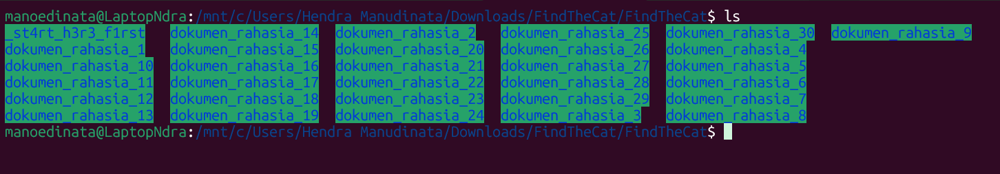
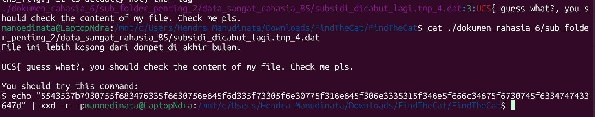

# find the cat in grep strings

Author: zelebwr

```
Help! I lost my cat in the very complicated and time-wasting directory.

Now I need to follow the story the directory depict.

Can you please help me follow the story to find my cat?
```

Inside the ZIP file, we have multiple directories:



Just try to find the flag with `grep`:

```
grep -r UCS .
```


The last one seems interesting:



Oooo, nice.

```
echo "5543537b7930755f683476335f6630756e645f6d335f73305f6e30775f316e645f306e3335315f346e5f666c34675f6730745f6334747433647d" | xxd -r -p
```

Jackpot.

Flag:

```
UCS{y0u_h4v3_f0und_m3_s0_n0w_1nd_0n351_4n_fl4g_g0t_c4tt3d}
```
