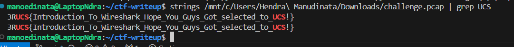

# Wiring

Author: Rev

```
Udah pada tau wireshark tentunya tau beberapa fitur yang ada lah ya hehe...
```

We don't even need Wireshark. Just get a string directly from the PCAP file.

```
$ strings challenge.pcap | grep UCS
3RUCS{Introduction_To_Wireshark_Hope_You_Guys_Got_selected_to_UCS!}
3RUCS{Introduction_To_Wireshark_Hope_You_Guys_Got_selected_to_UCS!}
```



Clean it then boom.

Flag:

```
UCS{Introduction_To_Wireshark_Hope_You_Guys_Got_selected_to_UCS!}
```
