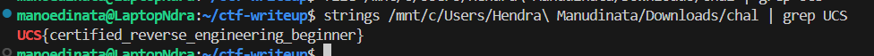

# password

Author: Hanz

```
Did you know the password? Resources:

https://dogbolt.org/
https://hex-rays.com/ida-pro
https://binary.ninja/
https://www.nsa.gov/ghidra
https://en.wikipedia.org/wiki/Ptrace
https://www.man7.org/linux/man-pages/man1/strings.1.html
```

We don't need GHidra, IDA, or any debugger. Just use strings-grep.

```
strings ./chal | grep UCS
```



Flag:

```
UCS{certified_reverse_engineering_beginner}
```
