# MinusLogika

- Author: idzoyy
- http://minictf.ucs.or.id:2131/

```
ga abis pikir itu dimana logikanya, sampe ikutan rusak Final Projectku. Nih kukasih buat lawan
```

Upon opening the site, we're greeted with a Login/Register page.

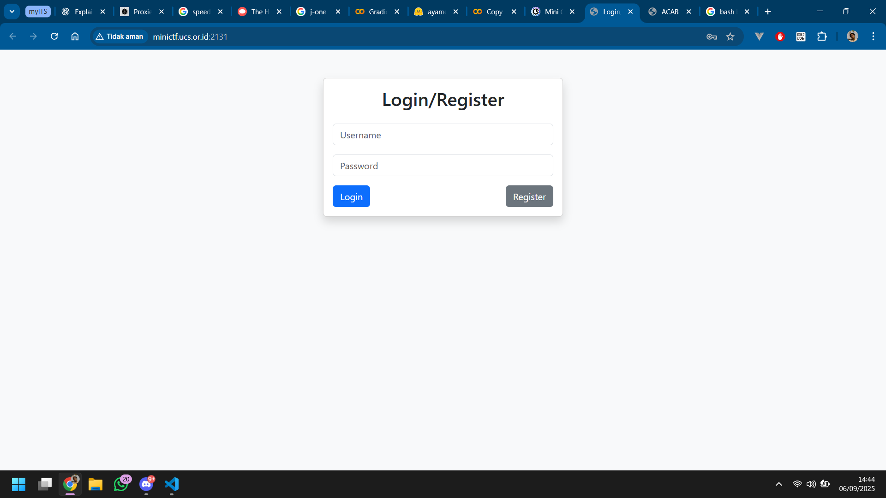

Register then login as usual, no tricks in this step.

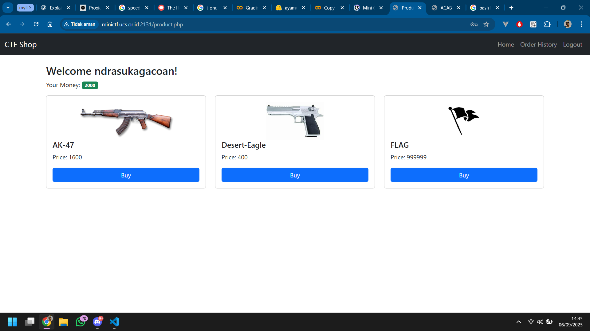

We need to buy the `FLAG` item, but we don't have enough money.

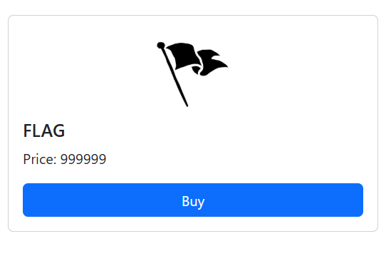

Inspecting the page, we can see that the value is coded in the HTML form input.

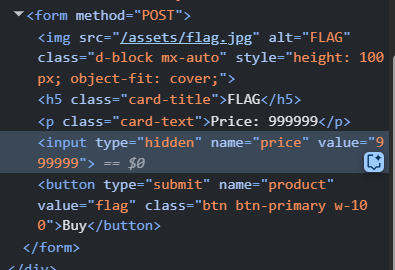

What if we change the price to 0? Nope.

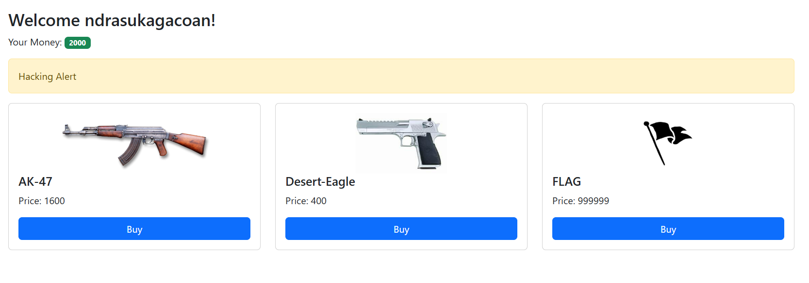

What about other product? Their price are coded in the form, too. Let's try changing it instead.

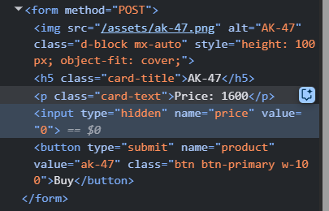

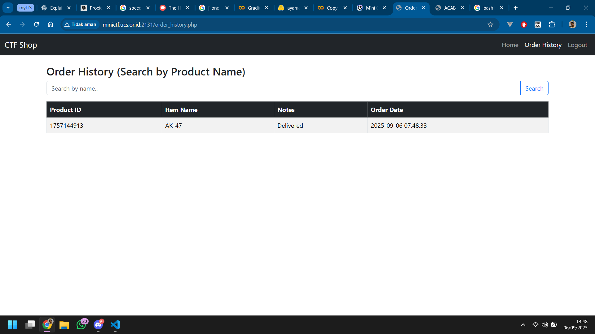

The order is successful, and our balance doesn't change!

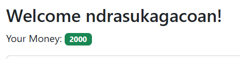

Now, what if we input a negative numbers so that our balance go higher.

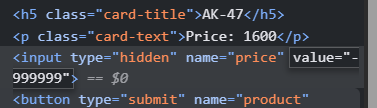

Boom. Nice!

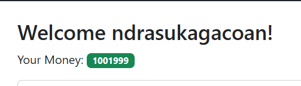

Let's buy the flag!

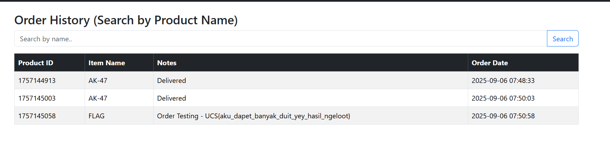

Flag:

```
UCS{aku_dapet_banyak_duit_yey_hasil_ngeloot}
```
